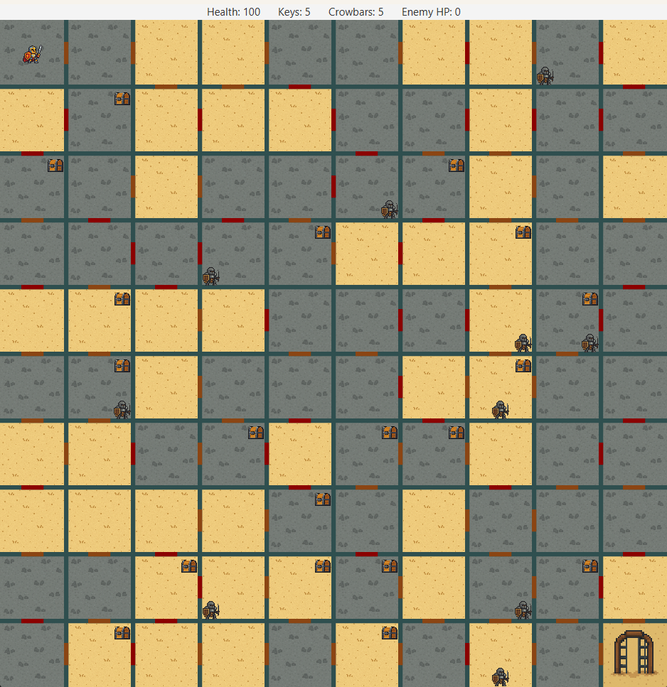

# 🧩 MazeGame-JavaFX

Welcome to **MazeGame-JavaFX**, a dynamic turn-based maze exploration game built using **Java** and **JavaFX**. This project blends strategy, procedural generation, and classic object-oriented programming in a cleanly designed grid-based adventure.

You play as a **Hero** exploring a maze filled with locked doors, chests, and hostile NPCs. Use limited resources like keys and crowbars to survive, solve the maze, and reach the exit alive!

---

## 📋 Table of Contents

- [🎮 Features](#-features)
- [📸 Preview](#-preview)
- [🧠 How to Play](#-how-to-play)
- [🗂 Project Structure](#-project-structure)
- [🛠 Setup Instructions](#-setup-instructions)
- [👥 Contributors](#-contributors)

---

## 🎮 Features

- ✅ **Playable Hero** with health, inventory, and movement logic
- 🧟 **NPCs** with randomized patrol and combat mechanics
- 🔐 **Chests & Doors** that require **Keys** or **Crowbars** to unlock
- 🧪 **Health Potions** for restoring Hero HP
- 🎲 **Procedural Generation** of the maze layout, doors, and loot
- 🧠 **Solvability Guarantee** via BFS and resource-based pathfinding logic
- 📦 **OOP Architecture** using interfaces, inheritance, and encapsulation
- 🧱 **JavaFX UI** with tile-based visual rendering and input handling

---

## 📸 Preview

>

---

## 🧠 How to Play

| Action             | Key                                      |
|--------------------|-------------------------------------------|
| Move Hero          | Arrow Keys or `W`/`A`/`S`/`D`             |
| Attack NPC         | `F`                                      |
| Open Chest         | `E` (when standing on a chest)           |
| Unlock Door        | Walk into it with a key or crowbar       |
| Win Condition      | Reach the **Exit Room** alive            |
| Lose Condition     | Hero's **HP drops to 0**                 |

---

## 🗂 Project Structure

```bash
MazeGame-JavaFX/
├── src/main/
│   ├── java/com/example/mazegameee/
│   │   ├── game/          # Controllers, UI, key handling
│   │   ├── objects/       # Items: Key, Crowbar, HealthPotion, Chest
│   │   ├── structures/    # Door and Room classes
│   │   ├── entities/      # Abstract game entities (Object, World)
│   │   └── LivingBeings/  # Hero and NPCs
│   └── resources/
│       ├── hero.png
│       ├── npc.png
│       ├── chest.png
│       ├── tilesand.png
│       ├── tilestone.png
│       └── maze-layout-custom.csv
├── pom.xml
└── README.md
```

---

## 🛠 Setup Instructions

Here’s a step-by-step guide to run the game locally.

### 1. 📦 Prerequisites

| Tool               | Required Version |
|--------------------|------------------|
| [Java JDK](https://www.oracle.com/java/technologies/javase-jdk17-downloads.html) | **17 or higher** |
| [JavaFX SDK](https://gluonhq.com/products/javafx/) | **17+** |
| [Maven](https://maven.apache.org/download.cgi) | Recommended (or use included wrapper) |

> 💡 **Using IntelliJ IDEA?** That’s the easiest setup. See below.

---

### 2. 📁 Clone the Repository

```bash
git clone https://github.com/Fidannnnn/MazeGame-JavaFX.git
cd MazeGame-JavaFX
```

---

### 3. 🧩 Configure JavaFX in IntelliJ IDEA

1. **Download JavaFX SDK** from [gluonhq.com](https://gluonhq.com/products/javafx/)
2. **Extract it** to a known location, e.g. `C:/javafx-sdk-17/`
3. Open the project in IntelliJ
4. Go to `File → Project Structure → Libraries → + → Java`  
   and select the `lib` folder inside your JavaFX SDK
5. Then go to `Run → Edit Configurations → VM Options` and paste:

```bash
--module-path "C:/javafx-sdk-17/lib" --add-modules javafx.controls,javafx.fxml
```

> ⚠️ Replace the path above with your actual JavaFX SDK path

---

### 4. ▶️ Run the Game

- Right-click `Main.java` and click **Run 'Main'**
- Or use Maven:

```bash
mvn clean javafx:run
```

Or:

```bash
java --module-path C:/javafx-sdk-17/lib --add-modules javafx.controls,javafx.fxml -jar target/MazeGameee-1.0-SNAPSHOT.jar
```

---

## 👥 Contributors

@fidannnnn
@shahin1717
@Lachi7
@Anar765

---

## 🙌 Feedback & Contributions

Found a bug or have an idea?  
You're welcome to **fork**, make improvements, and open a **pull request**.  
Stars ⭐ are also appreciated!

---

Thanks for checking out **MazeGame-JavaFX**!  
Enjoy exploring — and don't get stuck behind a locked door! 🚪🗝️
